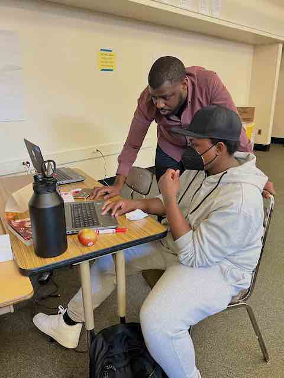
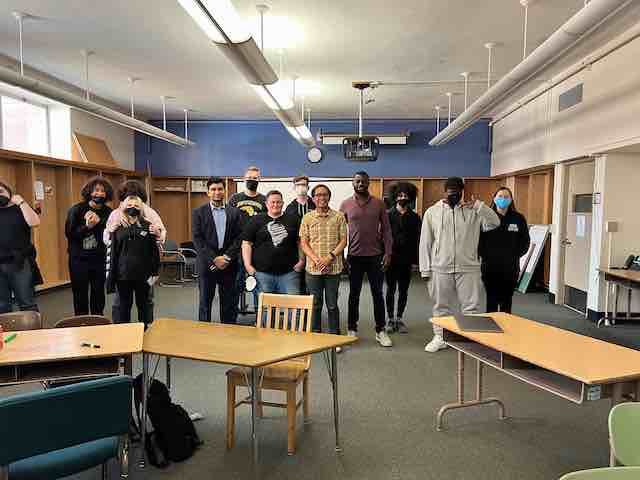
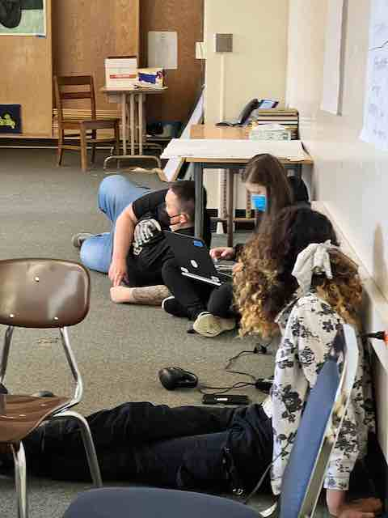

Title: My Blog
Date: 2023-07-04
Category: About Me
Tags: pelican

# November 2023
I've been on a journey of testing this past year and wanted to lay out the different types of testing including unit and integration testing.  Below is what I learned:
coverage report - is one measure of testing meaning simply increasing code coverage does not necessarily translate into better testing

# July 2023
Choosing Pelican  
Pelican is a web framework that uses Python. My friend Joe used it to build his site for the same reason.

# May 2023
Here's some pics from a hackathon I ran at Jefferson High School in Portland, Oregon.

